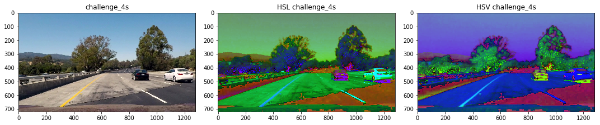
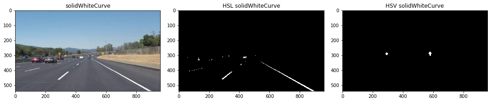
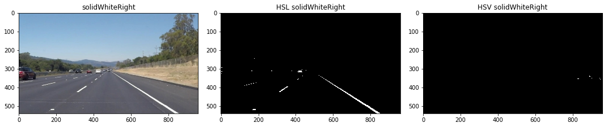

# **Finding Lane Lines on the Road** 
[](http://www.udacity.com/drive)

<p align="center">
    
</p>

Overview
---

In this particular project we were given the task to correctly identify lane lines on roads.  To achieve this, we had to rely on a number of packages but mainly **OpenCV** in order to detect these lane lines.

The code has been written and structured to fulfill the requirments for passing the project as given in the [project rubric](https://review.udacity.com/#!/rubrics/322/view). 

As a challenge to myself I also attempted the **Challenge video** for this project and so my pipeline will be tailored towards detecting lane lines on the **Challenge video** as well.


Table of Contents
---

1. [Getting Started](#getting-started)
2. [Isolating Lane Lines](#isolating-lane-lines)
3. [Waking]


Getting Started
---

**Finding Lane Lines on the Road**

This project has been completed on the Jupyter Notebook running Python 3 with the following packages:

```python
import os
import matplotlib.pyplot as plt
import matplotlib.image as mpimg
import numpy as np
import cv2
import math
from moviepy.editor import VideoFileClip
from IPython.display import HTML
```

Additionally, complementary **Helper Functions** were created in order to structure the code in a more efficient way.  The functions added are:

- `get_roi()` Helps in defining the region of the pciture we are interested in  
- `display_img` In order to help visualize and compare images  
- `convert_hsl()` Convert _RGB_ images into _HSL_ Color space  
- `convert_hsv()` Convert _RGB_ images into _HSV_ Color space  
- `isolate_yellow()` Specifically isolates yellow lines in a given image  
- `isolate_white()` Specifically isolates white lines in a given image  
- `isolate_lines()` Combines yellow and white isolated lines together  

Firstly before creating the pipeline, I had to create each individual component to ensure that my pipeline would work.  I then categorized my workflow into:  

1. Isolate/Filter Lanes in a given image  
2. Apply Canny Edge Detection  
3. Use Hough lines to return lane lines  
4. Extrapolate lane lines  
5. Display lane lines over image/video  

I then created a separate function `pipeline()` in order to combine all these different tasks together to make the workflow more effective.  


Isolating Lane Lines
---

So to start, after hours of trial and error with **RGB images**, the results were still not to my liking.  I then chose to play around with different color spaces other than RGB and as it turned out, I was able to get better results.  

HSL Color Space            |  HSV Color Space
:-------------------------:|:-------------------------:
  |  

The two color spaces I chose to use were HSV and HSL Color space.  I chose these 2 particularly because I noticed that **yellow lines** are displayed clearer in HSV format and **white lines** are displayed clearer in HSL format when compared with RBG format.  This can be seen from the picture below.

  
  
  
  
  
  


I then proceeded to isolate the lane lines from the image.  
**White** from HSL image.  
**Yellow** from HSV image.  






The way Canny Edge Detection works is that this method returns a high response value wherever this a sharp change in gradient of pixels in an image and a low response value where there is no sharp change.  This results in the picture retaining only the lines where there is a sharp change in pixel gradient.  

This can be seen in the picture provided by Udacity below where points A,C and E would be retained while the rest would be discarded.

    


### Reflection

### 1. Describe your pipeline. As part of the description, explain how you modified the draw_lines() function.

My pipeline consisted of 5 steps. First, I converted the images to grayscale, then I .... 

In order to draw a single line on the left and right lanes, I modified the draw_lines() function by ...

If you'd like to include images to show how the pipeline works, here is how to include an image: 

![alt text][image1]


### 2. Identify potential shortcomings with your current pipeline


One potential shortcoming would be what would happen when ... 

Another shortcoming could be ...


### 3. Suggest possible improvements to your pipeline

A possible improvement would be to ...

Another potential improvement could be to ...
