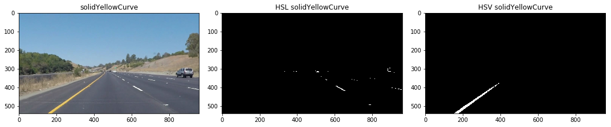
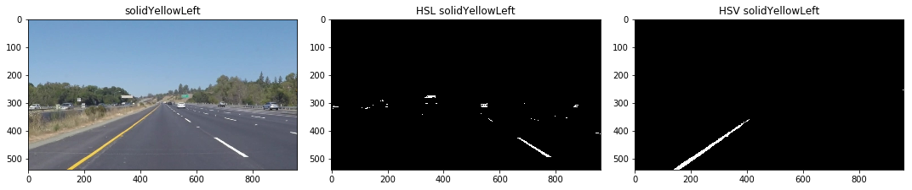
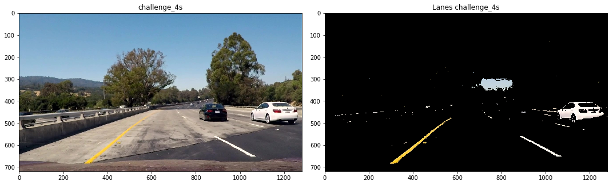
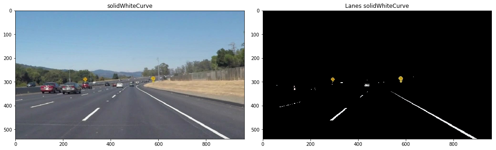
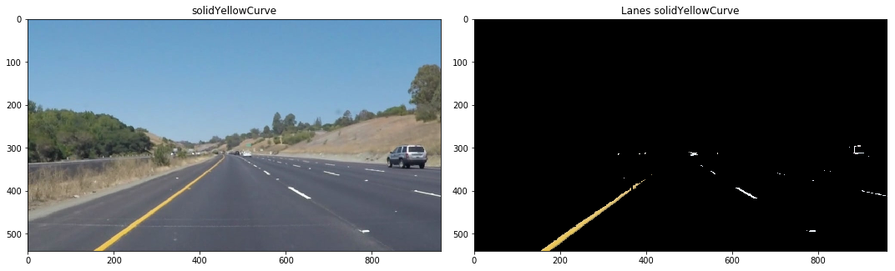
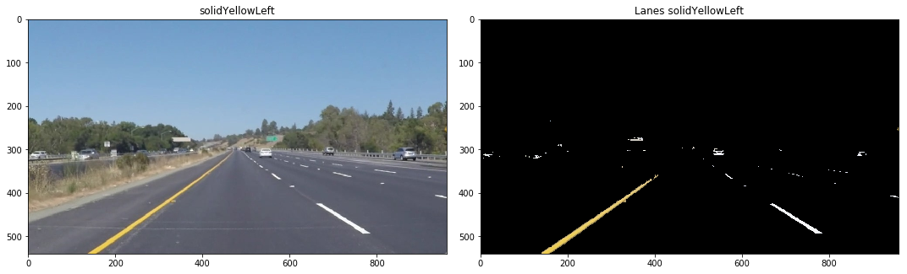
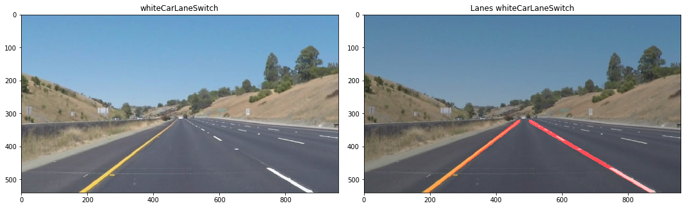

# **Finding Lane Lines on the Road** 
[](http://www.udacity.com/drive)

<p align="center">
    
</p>

Overview
---

In this particular project we were given the task to correctly identify lane lines on roads.  To achieve this, we had to rely on a number of packages but mainly **OpenCV** in order to detect these lane lines.

The code has been written and structured to fulfill the requirments for passing the project as given in the [project rubric](https://review.udacity.com/#!/rubrics/322/view). 

As a challenge to myself I also attempted the **Challenge video** for this project and so my pipeline will be tailored towards detecting lane lines on the **Challenge video** as well.


Table of Contents
---

1. [Getting Started](#getting-started)
2. [Isolating Lane Lines](#isolating-lane-lines)
3. [Line Detection](#line-detection)
4. [Lane Prediction](#lane-prediction)
5. [Reflection](#reflection)


Getting Started
---

**Finding Lane Lines on the Road**

This project has been completed on the Jupyter Notebook running Python 3 with the following packages:

```python
import os
import matplotlib.pyplot as plt
import matplotlib.image as mpimg
import numpy as np
import cv2
import math
from moviepy.editor import VideoFileClip
from IPython.display import HTML
```

Additionally, complementary **Helper Functions** were created in order to structure the code in a more efficient way.  The functions added are:

- `get_roi()` Helps in defining the region of the pciture we are interested in  
- `display_img` In order to help visualize and compare images  
- `convert_hsl()` Convert _RGB_ images into _HSL_ Color space  
- `convert_hsv()` Convert _RGB_ images into _HSV_ Color space  
- `isolate_yellow()` Specifically isolates yellow lines in a given image  
- `isolate_white()` Specifically isolates white lines in a given image  
- `isolate_lines()` Combines yellow and white isolated lines together  

Firstly before creating the pipeline, I had to create each individual component to ensure that my pipeline would work.  I then categorized my workflow into:  

1. Isolate/Filter Lanes in a given image  
2. Apply Canny Edge Detection  
3. Use Hough lines to return lane lines  
4. Extrapolate lane lines  
5. Display lane lines over image/video  

I then created a separate function `pipeline()` in order to combine all these different tasks together to make the workflow more effective.  


Isolating Lane Lines
---

So to start, after hours of trial and error with **RGB images**, the results were still not to my liking.  I then chose to play around with different color spaces other than RGB and as it turned out, I was able to get better results.  

<center>
    
HSL Color Space            |  HSV Color Space
:-------------------------:|:-------------------------:
  |  
    
</center>
The two color spaces I chose to use were HSV and HSL Color space.  I chose these 2 particularly because in these 2 colors spaces, the respective colors will be easier to isolate than in RGB.  

As seen in the image, for **HSL colors** the *hue* and *saturation* cover all ranges of colors, but *lightness* factor contributes to how dark that color represents.  This made it easy to just filter white lines based on the *lightness* factor.

As for **HSV colors**, as seen in the image, the yellow portion is bound to a small range in the *hue* and a larger part of *saturation* and *value* where having a large range dictates the different shades of yellow.  This is done so because yellow migth have different shades in an image and we want to correctly isolate the color.

The resutls can be seen below.

  
  
  
  
  
  


I then proceeded to isolate the lane lines from the image.  
**White** from HSL image.  
**Yellow** from HSV image.  







The results are looking promising!  I then combined these 2 steps together before grayscaling them and applying Canny Edge Detection.

  
  
  
  
  
  
  


Line Detection
---

Line detection is a 3 step process, first we sketch the lines that are present in an image, then we determine which lines in the picture are part of a lane line or are they something else.  Fortunately, `OpenCV` provides us with all the tools necessary to achieve this.

Firstly, to sketch or detect lines in an image we will be using **Canny Edge Detection** `cv2.Canny()`.  To give an overview, Canny Edge Detection returns a high response value wherever this a sharp change in gradient of pixels and a low response value where there is no sharp change in an image.  This results in an image retaining only the lines where there are sharp changes in pixel gradient.  Hence, the images will be converted to `grayscale` before applying the Canny Edge Detection method.

This is illustrated in the picture provided by Udacity below where points A, C and E would be retained while the rest would be discarded.


Secondly, after being able to sketch the lines, we will have identify all those lines that belong to a lane as accurate as possible.  **Hough Lines** `cv2.HoughLines()` is the best method for this.  Since lane lines are rather straight, one thing that is common for lane lines is its gradient.  This is the core in Hough Transform, different points of a line that have the same gradient will always interestect at the same point after using Hough Transform.  This is illustrated in the figure below.  I won't be covering the topic here but here is more information on [Hough Lines Transformation.](https://medium.com/@tomasz.kacmajor/hough-lines-transform-explained-645feda072ab)


Lastly, even after putting together Canny edge detection and hough lines, the lines detected will still be in batches and not show a straight line.  So in order to generate 1 single line that can be displayed and understood by our algorithm, we have to extrapolate it.  This is done by creating 2 additional functions `meas_line()` and `corrrected_lines()`.  These 2 functions take in all the lines detected by Hough Lines and separates them into left line and right line, then the lines will be fitted to a 1 degree polinomial.  This polynomial line would then be used as a reflection of the lane lines detected and displayed on the image.  This can be seen from the pictures below.





Lane Prediction
---

All the necessary components are ready for us to build the pipeline.  To keep things simple I've added all the functions to a new function `pipeline()`.  As seen in the video below, the algorithm was able to correctly identify lane lines in the video.  However, the lines are fluctuating too much and I needed to smoothen out the transition from lines detected in 1 frame to the next.  Hence, I turned to used a Kalman Filter.

<p align="center">
    
</p>

### Kalman Filter

Kalman Filters provide the necessary transition and prediction of lane lines.  The reason for using kalman filters is base more on bias rather than experimental.  Nevertheless, there have been many other resarches that have been using Kalman Filters for Lane Line Detections and have given promising results.  I chose to use a 2D Kalman Filter to predict positions of the left line and right line on an image.

I created a `KalmanLaneMemory` Class and provided neceassry functions in order to **Update** and **Predict** lane lines.  I think implemented the same pipeline but only now running the pipeline results through a **Kalman Filter** before returning the desired lane lines.

The difference in results before and after applying Kalman Filter can be seen when the 2 videos are juxtposed with each other.

<center>

Without Kalman Filter            |  With Kalman Filter
:-------------------------:|:-------------------------:
  |  

    
</center>

With this pipeline and lane prediction, I was able to complete the Challange video as seen from the 1st video at the of this writeup.


Reflection
---

Overall this project was very enjoyable and enabled me to learn more about lane detection and `OpenCV` as well as looking further on how to improve upon Lane Detection.

### Identify potential shortcomings with your current pipeline


One potential shortcoming of this method is its inability to detect where the road will be heading.  It does not know whether there will be a curve ahead or not.  However, it will detect straight lines with great accuracy.


### Suggest possible improvements to your pipeline

Instead of fitting a 1st order polynomial, maybe a 2nd order polynomial could be included in order to correctly idently the lanes as well as knowing the curvature of the lanes, whether it is a turn or a straight line.  One thing that comes to mind is using perspective transform and then fitting a 2nd order polynomial.
